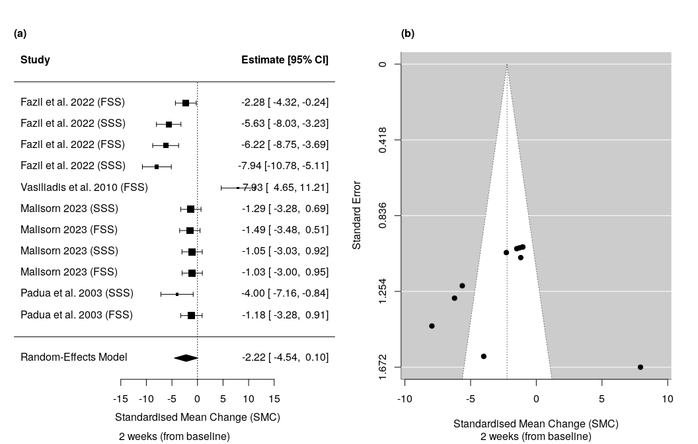

# Clinical Studies Review Tools

## Overview

`csrtools` is an R package designed to provide a workflow for
meta-analysis and cumulative effect size estimation. It provides
functions to compute standardised mean change (SMC), handle
heterogeneity statistics, and generate high-quality visualisations.

This package is particularly suited for researchers in medicine,
psychology, or any field that involves meta-analytical studies and
time-series data.

## Features

- **Run meta analysis**: Functions to calculate standardised mean change
  and heterogeneity statistics for time-series data.

- **Cumulative effects**: Compute cumulative effect sizes and their
  confidence intervals with propagated uncertainty estimates over
  specific time points.

- **Handle missing data**: Option to impute missing data with weighted
  means before time-series analysis.

- **Data visualisation**: Generate forest and funnel plots, pooled SMC
  time-series, and cumulative SMC time-series, with options to save
  multi-panel layouts.

## Installation

You can load the `csrtools` package by running the following:

``` r
# Install devtools if not already installed
#install.packages("devtools")

# Install CSRtools from GitHub
devtools::install_github("becky-turner/csrtools")
```

    ## 
    ## ── R CMD build ─────────────────────────────────────────────────────────────────
    ##      checking for file ‘/tmp/RtmpLXOpfm/remotesc25943db148c/becky-turner-csrtools-d658ac6/DESCRIPTION’ ...  ✔  checking for file ‘/tmp/RtmpLXOpfm/remotesc25943db148c/becky-turner-csrtools-d658ac6/DESCRIPTION’
    ##   ─  preparing ‘csrtools’:
    ##      checking DESCRIPTION meta-information ...  ✔  checking DESCRIPTION meta-information
    ##   ─  excluding invalid files
    ##      Subdirectory 'R' contains invalid file names:
    ##      ‘_globals.R’
    ##   ─  checking for LF line-endings in source and make files and shell scripts
    ##   ─  checking for empty or unneeded directories
    ##   ─  building ‘csrtools_0.1.0.tar.gz’
    ##      
    ## 

``` r
# Once installed, load the package
library("csrtools")
```

## Load example data and other packages

Note that the example dataset `bctq_data` loaded below has been
pre-processed for compatibility with the package.

``` r
# Load BCTQ example data
data(bctq_data)

# Load additional packages
library(metafor)
library(dplyr)
library(tidyr)
library(ggplot2)
```

## Example: Run standardised mean change meta-analysis

Run SMC meta analysis from baseline to 2 weeks for the open CTR group:

``` r
# Intervention = Open CTR
open_2weeks <- smc_tp(data=bctq_data[bctq_data$intervention_arm=="Open",], 
       outcome_mean = "mean_2weeks", 
       outcome_sd = "sd_2weeks",
       time_point = "2", time_unit = "weeks (from baseline)", 
       plot=TRUE)
```

<!-- -->

Now run the SMC meta analysis for the endoscopic CTR group with
heterogeneity statistics:

``` r
endoscopic_2weeks <- smc_tp(data=bctq_data[bctq_data$intervention_arm=="Endoscopic",], 
       outcome_mean = "mean_2weeks", 
       outcome_sd = "sd_2weeks",
       time_point = "2", time_unit = "weeks (from baseline)", 
       plot=FALSE, heterogeneity = TRUE)

print(endoscopic_2weeks)
```

    ##   time_point total_sample       smc lower_ci  upper_ci       I2        Q
    ## 1          2          279 -3.708781 -7.60795 0.1903888 94.10277 36.64795
    ##       tau2
    ## 1 21.78263

## Example: Plot pooled SMC across interventions

Here, calculate the pooled SMC across all interventions and visualise
the results as a time-series.

``` r
# Define column names and time points
outcome_means <- c("mean_1week", "mean_2weeks", "mean_3weeks", "mean_4weeks","mean_6weeks",
                   "mean_12weeks", "mean_24weeks", "mean_52weeks")

outcome_sds <- c("sd_1week", "sd_2weeks", "sd_3weeks", "sd_4weeks", "sd_6weeks",
                 "sd_12weeks", "sd_24weeks", "sd_52weeks")

time_points <- c("1", "2", "3", "4", "6", "12", "24", "52")

time_unit <- "weeks"

# Run pooled effect size analysis for all interventions

intervention <- "All"

(
  pooled_smc_all <- pooled_smc_tp(data = bctq_data,
                                      outcome_means = outcome_means,
                                      outcome_sds = outcome_sds,
                                      baseline_mean = "mean_baseline",
                                      baseline_sd = "sd_baseline",
                                      sample_size = "n_in_arm",
                                      time_points = time_points,
                                      time_unit = time_unit,
                                      intervention = intervention, plot = TRUE)
)
```

<!-- -->

    ##   time_point       smc   lower_ci   upper_ci time_unit intervention
    ## 1          1 -1.715620  -7.582391  4.1511512     weeks          All
    ## 2          2 -2.635566  -4.267949 -1.0031833     weeks          All
    ## 3          3 -1.329319  -2.145708 -0.5129294     weeks          All
    ## 4          4 -1.972626  -2.332391 -1.6128608     weeks          All
    ## 5          6 -3.061270  -4.586461 -1.5360790     weeks          All
    ## 6         12 -2.440204  -2.823823 -2.0565849     weeks          All
    ## 7         24 -3.430197  -4.204440 -2.6559543     weeks          All
    ## 8         52 -8.255571 -11.339153 -5.1719891     weeks          All

## Example: Calculate correlation coefficients

Calculate the correlation coefficients between BCTQ scores at baseline,
4 weeks and 12 weeks across all interventions.

``` r
outcome_means <- c("mean_baseline", "mean_4weeks","mean_12weeks")

means_all <- bctq_data[,outcome_means]
correlation_table(data = means_all, save_to_doc = FALSE)
```

|                   |   Variable    |      mean_baseline      |
|:-----------------:|:-------------:|:-----------------------:|
| **mean_baseline** | mean_baseline |  1.00 \[ NaN , NaN \]   |
|  **mean_4weeks**  |  mean_4weeks  | 0.56 \[ 0.26 , 0.76 \]  |
| **mean_12weeks**  | mean_12weeks  | 0.25 \[ -0.01 , 0.48 \] |

Table continues below

|                   |      mean_4weeks       |      mean_12weeks       |
|:-----------------:|:----------------------:|:-----------------------:|
| **mean_baseline** | 0.56 \[ 0.26 , 0.76 \] | 0.25 \[ -0.01 , 0.48 \] |
|  **mean_4weeks**  |  1.00 \[ NaN , NaN \]  |  0.91 \[ 0.8 , 0.96 \]  |
| **mean_12weeks**  | 0.91 \[ 0.8 , 0.96 \]  |  1.00 \[ NaN , NaN \]   |

## Example: Estimate cumulative effects

Calculate the cumulative SMC estimates with cumulative confidence
intervals for the open CTR group. Below, the `open_smc_data` subset
includes only data for the Open CTR subset of patients. The dataset was
curated using the `smc_tp` function above to calculate the SMC between
each time-point. Below, we calculate the cumulative confidence intervals
for the point estimates using a propagated-variance estimation.

``` r
# Calculate cumulative SMC
open_smc_data <- cumulative_smc(open_smc_data, 
                                smc_var = "smc", time_var = "time_point", 
                                intervention = "Open")

# Calculate cumulative confidence intervals (propagated-variance option)
open_smc_data <- cumulative_ci(open_smc_data, method = "wald")

# View the output
print(head(open_smc_data))
```

    ##   time_point total_sample        smc    lower_ci    upper_ci   smc_cum
    ## 1          1           35  1.7205467  1.42480945  2.01628389  1.720547
    ## 2          2          539 -3.0834493 -3.37142270 -2.79547595 -1.362903
    ## 3          3          238 -4.5813823 -4.95968705 -4.20307745 -5.944285
    ## 4          4         1978  0.3707095  0.09280147  0.64861761 -5.573575
    ## 5          6          439 -0.2324367 -0.51016365  0.04529025 -5.806012
    ## 6         12         2299 -1.0635138 -1.34589475 -0.78113278 -6.869526
    ##   intervention    var_cum lower_ci_wald upper_ci_wald
    ## 1         Open 0.02276669      1.424809     2.0162839
    ## 2         Open 0.04435370     -1.775685    -0.9501204
    ## 3         Open 0.08160758     -6.504199    -5.3843709
    ## 4         Open 0.10171194     -6.198665    -4.9484861
    ## 5         Open 0.12179010     -6.490021    -5.1220027
    ## 6         Open 0.14254682     -7.609531    -6.1295205

## Visualise cumulative effects

Here, we use a smoothing function over the cumulative SMC estimates
calculated from the step above and plot the point estimates with
propagated-variance confidence intervals as a time-series.

``` r
# Run from 0: add 0 time point
open_smc_data <- rbind(0, open_smc_data)

# Rename intervention names after adding 0 line.
open_smc_data$intervention <- "Open"

smc_smooth <- smooth_csmc(open_smc_data, csmc = "smc_cum",
                          lower_ci = "lower_ci_wald", upper_ci = "upper_ci_wald",
                          intervention = "intervention",
                          span = 0.3, time_series = seq(0, 52, 0.001))
```

<!-- -->

## Documentation

For detailed documentation on all functions, check the Reference Manual
or run:

``` r
help(package = "csrtools")
```

## Citation

Turner R, Hartrick O (2025). csrtools: Clinical Studies Review
Tools.https://doi.org/10.5281/zenodo.14841467.

## Contributing

Contributions, suggestions, and bug reports are welcome! Please use the
issues page to report bugs or request features.

## Authors

- Becky Turner (maintainer)
- Olivia Hartrick

# License

This package is licensed under the MIT license. See LICENSE for details.
